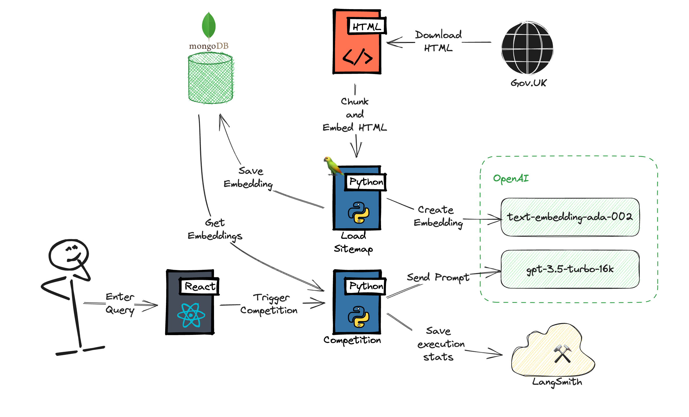

# 🏛️ GovGPT

> This is not a production ready solution, its is innovation project to showcase using Langchain, OpenAI and MongoDB Atlas to build a knowledge base Q&A system.



## Requirements

- Python 3.10 or higher
- OpenAI API key
- MongoDB Atlas
- Optional: LanSmith access

## Setup

- Install dependencies: `pip install -r requirements.txt`
- Add OpenAI API key to .env
- Setup a MongoDB Atlas cluster and add the connection string to .env
- Create Search Index, see [here](https://python.langchain.com/docs/integrations/vectorstores/mongodb_atlas) for JSON to create index.
- Optional: Create LangSmith account and add credentials to .env

## Running

### Downloading Sitemaps

Download all the sitemaps from [GovUK Sitemap](https://www.gov.uk/sitemap.xml) and save to `/pending`.

```bash
python3 download_sitemaps.py
```

### Embed Sitemaps

Embed the sitemaps into the model. This is done by running `embed_sitemaps.py` which will generate the embeddings and save to the database.

```bash
python3 embed_sitemaps.py
```

### Run Server

Run the server to serve the API `POST /api/completions`. This is used by the frontend to generate and return completions.

```bash
python3 api.py
```

#### POST /api/completions

##### Request

```json
{
    "prompt": "Example prompt",
    "temperature": 0.7,
}
```
##### Response

```json

{
    "question": "",
    "answer": "",
    "source_documents": [
        {
            "_id": "65060c2ef23650680327aa39",
            "page_content": "Embedded content 1",
            "metadata": {
                "source": "https://www.gov.uk/carers-allowance/eligibility",
                "sitemap": "sitemap_23.xml",
                "page_type": "guide",
                "loc": "https://www.gov.uk/carers-allowance/eligibility",
                "lastmod": "2023-09-05T14:12:19+01:00",
                "priority": "0.615"
            }
        }
    ],
    "stats": {
        "total_tokens": 2849,
        "prompt_tokens": 2300,
        "completion_tokens": 549,
        "successful_requests": 1,
        "total_cost": 0.009096
    }
}
```
